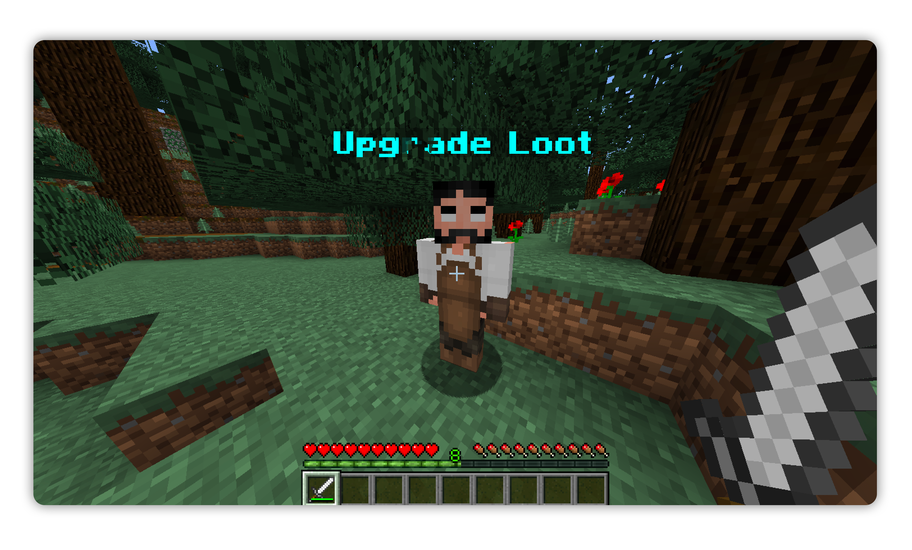
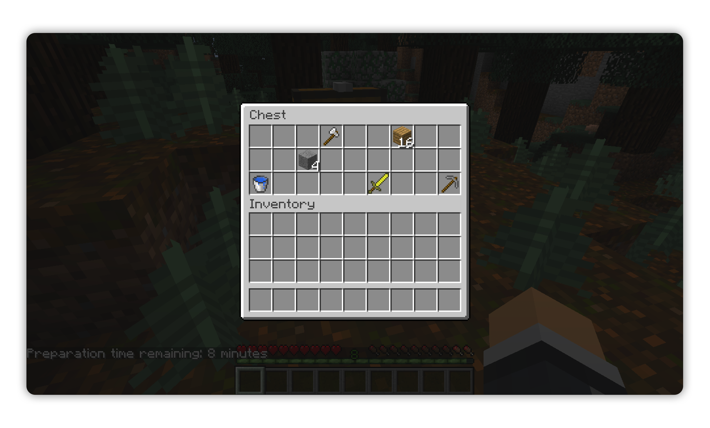

# 🏰 Siege — Attackers vs Defenders

**A fast-paced PvP minigame for Spigot servers**  
Two sides, one king. Defenders must build and protect. Attackers must break through and slay the king.
> ⚠️ This plugin is experimental and intended for testing, prototyping, or forking — not production use.

---

## 🕹️ Gameplay Overview

- 👑 **Defenders**
    - Start inside the keep.
    - Loot chests for weapons, armor, and resources.
    - Build defensive walls within a restricted **cuboid region**.
    - Protect the **King** at all costs.
    - Can respawn after death.

- ⚔️ **Attackers**
    - Begin outside the castle.
    - Loot chests for weapons, armor, and tools.
    - Break through walls and **invade** after the timer ends.
    - Cannot respawn — every life counts.
    - Victory by **killing the King**.

- ⏳ **Match Flow**
    1. **Prep Phase** (5 min): Attackers loot, defenders build.
    2. **Siege Phase**: Attackers advance and attempt to breach.
    3. **End**: Game ends when the King dies, every attackers is slayed or time runs out.

---

## 🧱 Key Features

- 🧭 **Cuboid-Restricted Building** — Defenders can only build inside a clearly visualized wall zone.
- 🧍 **Blacksmith NPC** — A custom NMS entity acts as the blacksmith. He can upgrade weapons and armors.
- 🧠 **Dynamic Loot System** — Randomized, weighted loot tables for unique game experiences.
- 💥 **Attackers vs Defenders** — Simple but tense team gameplay.
- 🌍 **Protected World** — No mob spawns, no weather, no random griefing. Pure controlled gameplay.
- 🧊 **Particle Wall Preview** — Real-time visualization of the building boundary.

---

## 🧠 Tech Behind the Game

- 🛰️ **NMS & Packet Interception**
    - Used to create NPCs and handle interactions efficiently.
    - Allows more precise control than Bukkit events alone.

- 📦 **Cuboid Region Logic**
    - Clean boundary calculations.
    - Visual feedback with particles.
    - Enforced building restrictions based on team & phase.

- 🧱 **Custom Effects & UI**
    - Action bar messages, titles, and particle effects for immersion.
    - World control (no weather, explosions, or mobs) ensures consistent gameplay.

---

## 🖼️ Gameplay Showcase

  

  

  

  

  

  

---

## 🧭 Commands (Example)

| Command                | Description                            |
|-------------------------|------------------------------------------|
| `/siege start`          | Starts a new siege game.               |
| `/siege stop`           | Forces the game to stop.               |
| `/siege team join <t>`  | Join a team (`attacker` / `defender`). |
| `/siege king`           | Spawn or manage the King NPC.         |

---

## 🧪 Development Notes

- This project is a **proof of concept**.
- Not a fully featured minigame — perfect for:
    - Experimenting with **NMS**, packets & custom entities.
    - Extending the gameplay loop.
    - Forking and customizing.

> Contributions and forks are welcome 🤝
or extend at your own risk. Ideal for testing, not production servers.